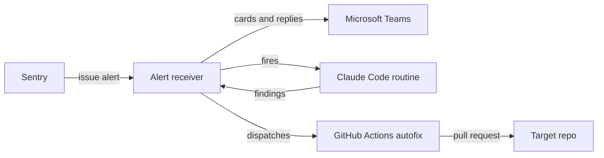

<picture>
  <source media="(prefers-color-scheme: dark)" srcset="docs/brand/header/sentinel-header-dark.svg">
  <source media="(prefers-color-scheme: light)" srcset="docs/brand/header/sentinel-header-light.svg">
  
</picture>

**[Documentation](https://sentasity.github.io/sentinel/)**

Unattended investigation of Sentry issues, with optional autofix pull requests. When a new or regressed issue fires, the engine posts an alert card to Microsoft Teams, then triggers an unattended Claude Code session that checks out the repo at the event's release SHA, investigates the stack trace, and replies to the alert thread with its findings. Findings that clear a confidence gate can go one step further: a GitHub Actions workflow writes the fix and opens a pull request for human review. Nothing merges automatically.

The investigation sessions run as Claude Code cloud routines; the autofix workflow authenticates with a Claude Code OAuth token.

## How it works



1. **Alert.** Sentry webhooks each issue alert to the receiver, a single Lambda behind a Function URL. The receiver verifies the signature, renders an Adaptive Card, and posts it to a Teams channel through its own bot identity.
2. **Gate and enqueue.** Eligible alerts (error-level, an investigated environment, a release that resolves to a commit SHA) are enqueued in DynamoDB with a debounce.
3. **Investigate.** A scheduled sweep batches pending issues per project and release and fires a Claude Code cloud routine. The session checks out the target repo at the release SHA, investigates each issue, and posts a findings document back to the receiver, which renders it as a reply in the alert's Teams thread.
4. **Autofix.** Findings above the configured confidence and fixability minimums dispatch a GitHub Actions workflow. An unattended session writes the fix; a separate publish step opens the PR as a GitHub App. The workflow reports back to the receiver, which replies in the thread with the outcome.

The full component walkthrough is in the [architecture reference](https://sentasity.github.io/sentinel/operate/architecture/), and the security model for the unattended sessions has [its own page](https://sentasity.github.io/sentinel/security-model/).

## Repository layout

- [`receiver/`](receiver/) — the alert receiver Lambda: webhook handling, card rendering, the Teams bot client, the investigation pipeline, and the autofix gate
- [`infra/`](infra/) — self-contained CDK v2 app that deploys the receiver
- [`prompts/`](prompts/) — the stored prompts for the unattended sessions (investigator, configuration probe, autofix)
- [`runner/`](runner/) — the autofix session runner executed by the Actions workflow
- [`config/`](config/) — per-target-project engine configuration
- [`teams-app/`](teams-app/) — Teams app manifest and package for the notification bot
- [`scripts/`](scripts/) — operational tooling: secret bootstrap, card preview, bot smoke test, Sentry rule migration
- [`website/`](website/) — the documentation site, which is the canonical home for the docs
- [`docs/`](docs/) — pointers to the site, plus the brand asset generators
- [`tests/`](tests/) — pytest suite covering the receiver, the CDK template, and the tooling

## Setup

Four one-time steps, in order:

1. **Microsoft side** ([Microsoft setup](https://sentasity.github.io/sentinel/deploy/microsoft/)): Entra app registration, Azure Bot, and the Teams app install that gives the receiver its bot identity.
2. **Sentry side** ([Sentry setup](https://sentasity.github.io/sentinel/deploy/sentry/)): the internal integration that webhooks alerts to the receiver.
3. **Configuration**: copy [config/receiver.yaml.example](config/receiver.yaml.example) to `config/receiver.yaml` and fill in the knobs (environments, caps, trigger endpoint). That file stays out of git. New deployments start in `shadow` mode, which records what would have fired without firing anything.
4. **Deploy** ([infra/README.md](infra/README.md)): bootstrap secrets into SSM and `cdk deploy` the receiver stack.

Running Sentinel means bringing your own accounts: a Sentry organization, a Microsoft 365 tenant, an AWS account, a GitHub App, and Claude Code access for the investigation sessions.

Day-to-day operations (credential inventory, rotation runbooks, the end-to-end proof point) are in the [runbooks](https://sentasity.github.io/sentinel/operate/runbooks/).

## Development

```bash
python3.12 -m venv .venv
.venv/bin/pip install -e ".[dev]"
.venv/bin/python -m pytest -q
```

The test suite is the gate: it covers the receiver logic, renders the Teams cards against goldens, and synthesizes the CDK template.

## License

Apache-2.0. See [LICENSE](LICENSE).
