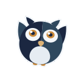

# Sentinel mark assets

One adopted mark, `perch`, as a complete asset set, plus [dancing versions](#dancing-gifs)
of it for chat. The README banner that pairs it with the wordmark lives in
[../header](../header/README.md). It is built from the
Sentasity palette: navy `#1b2741` and steel `#2f485e` build the bird, amber `#c98a3c`
holds the irises and the feet, amber-300 `#ddb377` the beak, and a cool off-white
family carries every pale area.

| Off-white | Value | Where |
|---|---|---|
| off-100 | `#e6ecf2` | The chest |
| off-050 | `#f4f7fa` | The eye discs |
| off-000 | `#ffffff` | The catchlights |

Cream was removed from the brand deliberately. A large warm pale area made warmth the
dominant impression of every asset and left the amber accents nothing to contrast
against; the irises read stronger without it.

## What is in the folder

| File | Use |
|---|---|
| `perch.svg` | The mark on a transparent ground. The source of truth; scale this, do not upscale a PNG. |
| `perch-tile.svg` | The mark inset on a square amber tile. Use wherever the background is dark or unknown. |
| `perch-outline.svg` | White silhouette with the eyes knocked out. Monochrome contexts only. |
| `perch-{16..1024}.png` | Transparent raster at 16, 32, 48, 64, 128, 256, 512, 1024. |
| `perch-tile-192.png` | Opaque tile at 192px. This is the size Teams wants for a color icon. |
| `perch-tile-512.png` | Opaque tile at 512px, for GitHub org avatars and anywhere else an avatar is wanted. |
| `perch-outline-32.png` | White silhouette at 32px, transparent. This is the size Teams wants for an outline icon. |
| `perch-sentry.svg` | Black silhouette with the face knocked out, inset to clear a circular crop. |
| `perch-sentry-256.png` | Black silhouette at 256px, transparent. This is what Sentry's small icon upload accepts. |
| `perch-favicon.ico` | Multi-resolution icon bundling 16, 32, and 48. |

## Why the tile is amber, and why it insets the mark

A tile has to let two things read at once: the navy body and the off-white chest.
White never really did. The chest measures 1.19:1 against white and survives only
because the dark body encircles it, which is a shape reading by accident rather than
by design. Against amber `#c98a3c` the navy body measures 5.08:1 and the chest 2.46:1,
so both hold, and a warm square is also the most identifiable thing in a Teams sidebar
or a GitHub organisation list otherwise full of blue and grey.

Steel, amber-300, and a mid-blue were all measured and rejected: steel leaves the body
at 1.56:1, amber-300 drops the chest to 1.64:1, and the blues balance well but do not
stand out at avatar size.

A tile that bleeds the mark to its edges is mostly bird, so insetting puts ground back
around the silhouette. The inset is `TILE_FIT = 0.70`. That number is Microsoft's: it
masks the color icon's corners itself and wants the brand mark inside a 120x120 safe
area of the 192x192 canvas, balanced around 96x96. The mark spans about 56 units of its
64-unit frame, so its height in a 192px tile is `56 x 3 x TILE_FIT`, which lands 117.6px
at 0.70. That is the largest value that still clears the safe area; 0.71 breaches it.

The tiles are square for the same reason: a pre-rounded upload is something the Teams
icon guidance calls out by name, because the client rounds it again.

## Wiring it into the Teams app

`teams-app/` needs exactly two files, a 192px color icon and a 32px outline icon, and
`build-package.sh` refuses to build without them:

```bash
cp docs/brand/assets/perch/perch-tile-192.png   teams-app/color.png
cp docs/brand/assets/perch/perch-outline-32.png teams-app/outline.png
```

Bump `version` in `teams-app/manifest.json` at the same time. The Teams admin centre
compares against the published version, not against the package contents, so even an
icon-only change needs the bump or the upload is rejected.

## Wiring it into the Sentry integration

Sentry → Settings → Developer Settings → the `sentinel` integration → Small Icon →
Upload an image, then Save Avatar. Sentry recolors the icon and crops it to a circle,
so the upload has to be square, between 256px and 1024px, and made of black and
transparent pixels only.

```
docs/brand/assets/perch/perch-sentry-256.png
```

The `-sentry` files differ from `-outline` in three ways that matter here: black
instead of white, the eyes knocked out as full discs with the pupils left behind as
islands so the face still reads, and the whole mark inset to 88% so the ear tufts and
feet clear the circle. Sentry renders this icon small inside UI components, which is
what the larger eyes and the knocked-out beak are for.

## Dancing GIFs

`perch-dance/` holds the mark as looping GIFs, for celebrating in chat when
Sentinel lands a fix.

  

| File | Use |
|---|---|
| `perch-hop-{128,512}.gif` | Hops side to side, raising the wing opposite each lean. Outlined. |
| `perch-hop-bare-{128,512}.gif` | The same hop without the outline, for backgrounds known to be light. |
| `perch-roof-{128,512}.gif` | Bounces in place and pushes both wings up on every beat. Outlined. |

The 128px files are for custom emoji. Slack caps an emoji upload at 128 KB and all
three fit. The 512px files are for posting into a message. Every dance is 24 frames
of 40ms, a 0.96s loop holding two beats at 125 bpm.

The owl gains wings for this. The static mark has none, so each dancing wing is
rooted inside the body and drawn behind it, and takes the colour of the opposite
half so it separates from the side it swings out of.

### Why the outline

On a dark chat background (`#1a1d21`) the navy half of the body measures 1.14:1 and
the steel half 1.78:1, so the owl reduces to its eyes and chest. The outline is
off-050 `#f4f7fa`, which measures 15.7:1 there and 1.08:1 against white, so it
separates the bird on dark themes and vanishes on light ones. GIF transparency is
all or nothing per pixel, which leaves every edge hard-cut; the outline also hides
that stair-stepping where it would show most. The bare variant is for the places
where the background is known to be light.

## Regenerating

`docs/brand/build_assets.py` rebuilds every file in `perch/`, and
`docs/brand/build_dance.py` every file in `perch-dance/`, both from the shape and
color definitions in `docs/brand/gen_round3.py`. Only the adopted mark is built.
Both need `rsvg-convert` and `magick` on PATH.

```bash
cd docs/brand && python3 build_assets.py && python3 build_dance.py
```

`gen_round3.py` still defines the three candidates `perch` beat during selection
(`curious-cream`, `curious-frost`, `perch-shaded`) as the record of that round. Their
committed assets were removed when the round closed and are recoverable from git
history.
