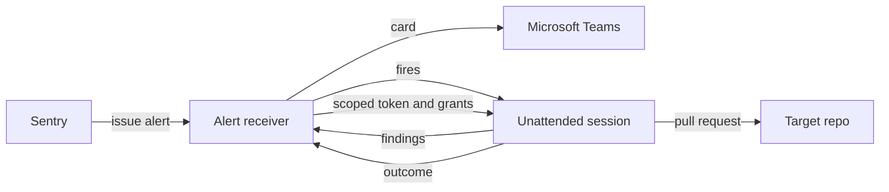

Four stages, each with a gate that can stop the issue going further.

## 1. Alert

Sentry webhooks each issue alert to the receiver. The receiver verifies the HMAC
signature, parses the alert, renders an Adaptive Card, and posts it to the Teams
channel configured for that environment.

It posts through its own bot identity rather than through an incoming webhook, and
that choice is load-bearing: posting as a bot returns the message id synchronously,
which is what makes every later step able to reply in the same thread. Findings and
autofix outcomes land under the alert they belong to instead of as loose messages.

## 2. Gate and enqueue

An alert is worth investigating when three things hold: it is error-level, it is in an
environment you asked to investigate, and its release resolves to a commit SHA.

That third condition is stricter than it sounds. Investigating at the release SHA is
the whole point, because it is the code that actually produced the error. If a release
cannot be resolved to a commit, the alternative would be investigating the default
branch instead, which is a different program than the one that crashed. Sentinel skips
the issue rather than doing that.

Eligible alerts are enqueued with a debounce, so a deploy that lights up nine related
issues becomes one batch rather than nine sessions.

## 3. Investigate

Every minute a sweep groups due issues by project and release, respects the per-sweep
and daily fire caps, and fires one session per batch. The session checks the repository
out at the release SHA, investigates each issue in the batch, and posts a findings
document back to the receiver, which renders it as a reply in the alert's thread.

A batch whose findings never arrive is failed loudly into the thread once its deadline
passes. This matters more than it looks: the failure mode you cannot see is a session
that dies quietly and leaves an alert looking investigated when nothing happened.

## 4. Autofix

A finding proceeds to autofix only when every one of these holds: confidence and
fixability each clear their configured minimums, the project is on the allowlist, no
cited file matches a forbidden or excluded path, no fix has already been attempted for
that issue in that environment on that release, and the daily pull-request cap has
budget left.

When it does, the fix happens in the session that just reported the finding, not in a
second one afterwards. The receiver mints a GitHub App installation token scoped to the
target repository, good for an hour and for nothing but writing contents and opening
pull requests, and returns it in the response to the findings POST along with one grant
per approved finding.

The reason it travels that way is worth stating plainly, because it shapes everything
else: the receiver can answer a session that calls it, but it cannot message a session
that is already running. The response body is the only channel there is.

The session then checks out the base branch, confirms the defect is still there and that
the branch has not moved in ways that invalidate the diagnosis, writes the fix and a
test that fails without it, pushes, and opens a pull request as the App. It reports the
outcome back to the receiver, which verifies the pull request really was authored by the
App before posting it into the Teams thread. A grant that never reports is failed into
the thread once its hour is up.

The gate stays on the receiver rather than moving into the session, and the token is
narrower than the session's own reach. [The security model](/sentinel/security-model/)
explains why both of those matter.

## The gates, in one table

Defaults as they ship in `config/receiver.yaml.example`.

| Gate | Default | What it does |
|---|---|---|
| `trigger_mode` | `shadow` | Runs the gate and records what would have fired, firing nothing |
| `environments` | `prod`, `staging` | Which Sentry environments are investigated at all |
| `investigation.debounce_seconds` | 60 | How long a new issue waits, so related issues batch |
| `investigation.max_batch_issues` | 8 | Most issues handed to one session |
| `investigation.per_sweep_fire_cap` | 4 | Most sessions fired in one minute |
| `investigation.daily_fire_cap` | 40 | Most sessions fired in a day |
| `investigation.deadline_seconds` | 900 | After this, the batch is failed into the thread |
| `caps.max_turns` | 50 | Hard ceiling on one unattended session |
| `autofix.enabled` | `false` | Whether findings can open pull requests at all |
| `autofix.min_confidence` | `high` | Minimum confidence for a fix attempt |
| `autofix.min_fixability` | `medium` | Minimum fixability for a fix attempt |
| `autofix.exclude_paths` | empty | Cited paths that veto a fix attempt |
| `autofix.daily_pr_cap` | 5 | Most pull requests opened in a day |

Every one of these is a config value, so tightening a gate is a deploy rather than a
code change. [Configure and deploy](/sentinel/deploy/configure/) covers setting them.
